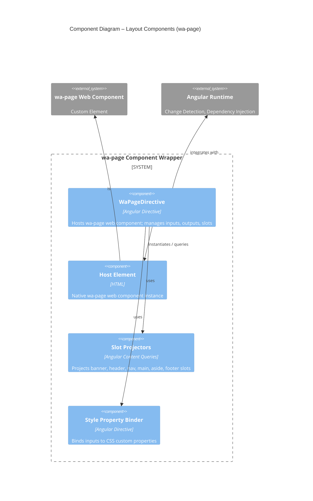

```mermaid
C4Component
    title Component Diagram – Layout Components (wa-page)
    
    System_Boundary(layout_comp, "wa-page Component Wrapper") {
        Component(wa_page_dir, "WaPageDirective", "Angular Directive", "Hosts wa-page web component; manages inputs, outputs, slots")
        Component(wa_page_host, "Host Element", "HTML", "Native wa-page web component instance")
        Component(slot_projector, "Slot Projectors", "Angular Content Queries", "Projects banner, header, nav, main, aside, footer slots")
        Component(style_binder, "Style Property Binder", "Angular Directive", "Binds inputs to CSS custom properties")
    }
    
    System_Ext(webawesome_page, "wa-page Web Component", "Custom Element")
    System_Ext(angular_runtime, "Angular Runtime", "Change Detection, Dependency Injection")
    
    Rel(wa_page_dir, wa_page_host, "instantiates / queries")
    Rel(wa_page_dir, slot_projector, "uses")
    Rel(wa_page_dir, style_binder, "uses")
    Rel(wa_page_host, webawesome_page, "is")
    Rel(wa_page_dir, angular_runtime, "integrates with")
```
