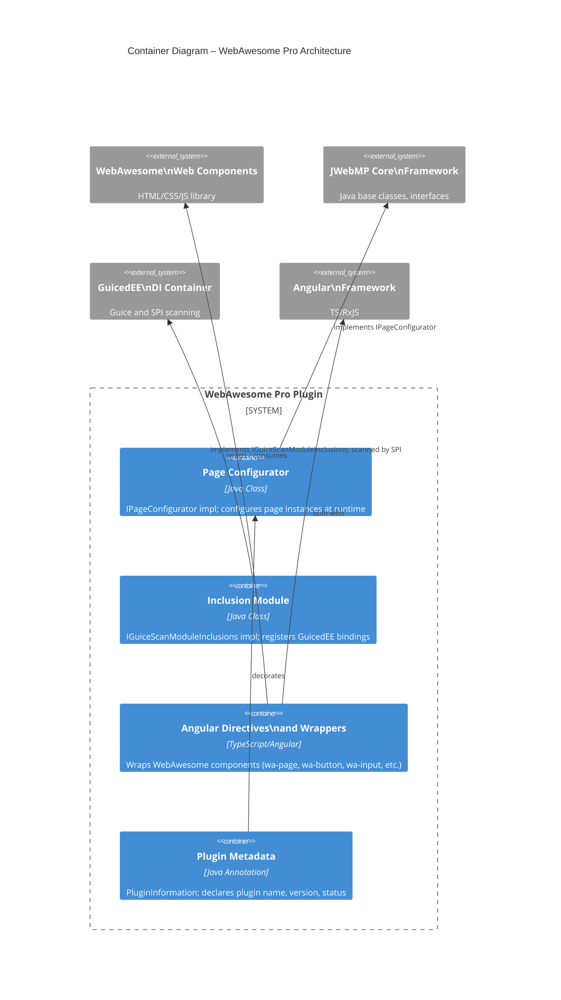

```mermaid
C4Container
    title Container Diagram – WebAwesome Pro Architecture
    
    System_Boundary(wa_pro_system, "WebAwesome Pro Plugin") {
        Container(page_config, "Page Configurator", "Java Class", "IPageConfigurator impl; configures page instances at runtime")
        Container(inclusion_mod, "Inclusion Module", "Java Class", "IGuiceScanModuleInclusions impl; registers GuicedEE bindings")
        Container(components, "Angular Directives\nand Wrappers", "TypeScript/Angular", "Wraps WebAwesome components (wa-page, wa-button, wa-input, etc.)")
        Container(metadata, "Plugin Metadata", "Java Annotation", "PluginInformation; declares plugin name, version, status")
    }
    
    System_Ext(webawesome_lib, "WebAwesome\nWeb Components", "HTML/CSS/JS library")
    System_Ext(jwebmp_core, "JWebMP Core\nFramework", "Java base classes, interfaces")
    System_Ext(guicedee_lib, "GuicedEE\nDI Container", "Guice and SPI scanning")
    System_Ext(angular_lib, "Angular\nFramework", "TS/RxJS")
    
    Rel(page_config, jwebmp_core, "implements IPageConfigurator")
    Rel(inclusion_mod, guicedee_lib, "implements IGuiceScanModuleInclusions; scanned by SPI")
    Rel(components, webawesome_lib, "wraps / consumes")
    Rel(components, angular_lib, "built with")
    Rel(metadata, page_config, "decorates")
```
