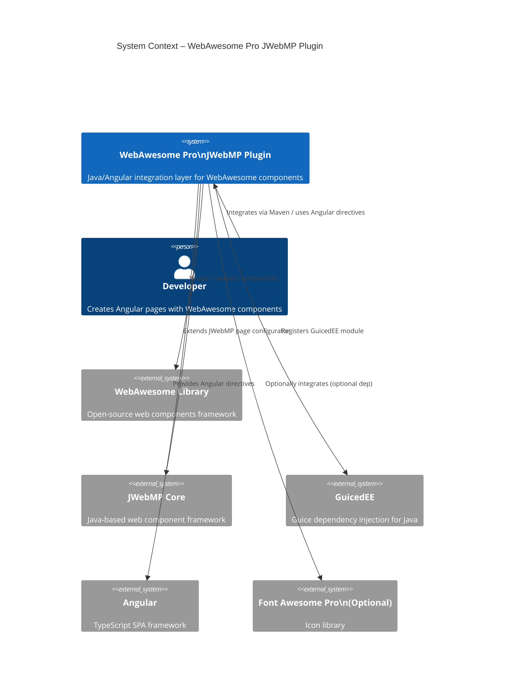

```mermaid
C4Context
    title System Context – WebAwesome Pro JWebMP Plugin
    
    System(wa_pro, "WebAwesome Pro\nJWebMP Plugin", "Java/Angular integration layer for WebAwesome components")
    
    Person(dev, "Developer", "Creates Angular pages with WebAwesome components")
    System_Ext(webawesome, "WebAwesome Library", "Open-source web components framework")
    System_Ext(jwebmp, "JWebMP Core", "Java-based web component framework")
    System_Ext(guicedee, "GuicedEE", "Guice dependency injection for Java")
    System_Ext(angular, "Angular", "TypeScript SPA framework")
    System_Ext(fontawesome, "Font Awesome Pro\n(Optional)", "Icon library")
    
    Rel(dev, wa_pro, "Integrates via Maven / uses Angular directives")
    Rel(wa_pro, jwebmp, "Extends JWebMP page configurator")
    Rel(wa_pro, guicedee, "Registers GuicedEE module")
    Rel(wa_pro, webawesome, "Wraps / exposes components")
    Rel(wa_pro, angular, "Provides Angular directives")
    Rel(wa_pro, fontawesome, "Optionally integrates (optional dep)")
```
