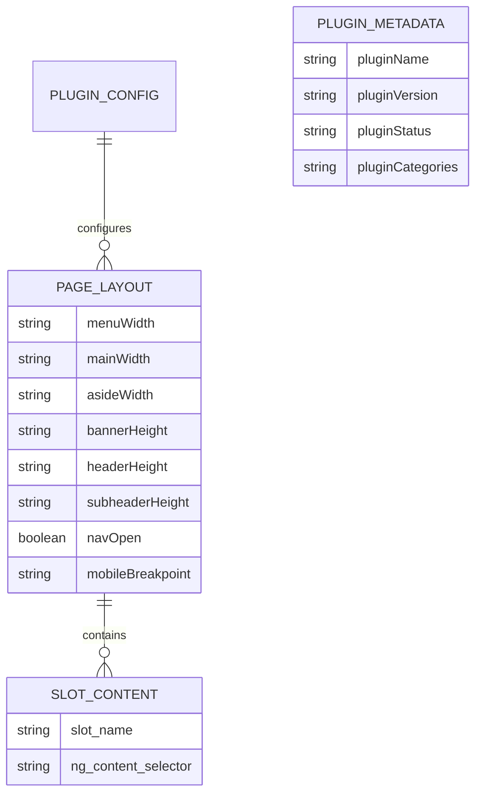

```mermaid
erDiagram
    PLUGIN_CONFIG ||--o{ PAGE_LAYOUT : configures
    PAGE_LAYOUT ||--o{ SLOT_CONTENT : contains
    PAGE_LAYOUT {
        string menuWidth
        string mainWidth
        string asideWidth
        string bannerHeight
        string headerHeight
        string subheaderHeight
        boolean navOpen
        string mobileBreakpoint
    }
    SLOT_CONTENT {
        string slot_name
        string ng_content_selector
    }
    PLUGIN_METADATA {
        string pluginName
        string pluginVersion
        string pluginStatus
        string pluginCategories
    }
```
