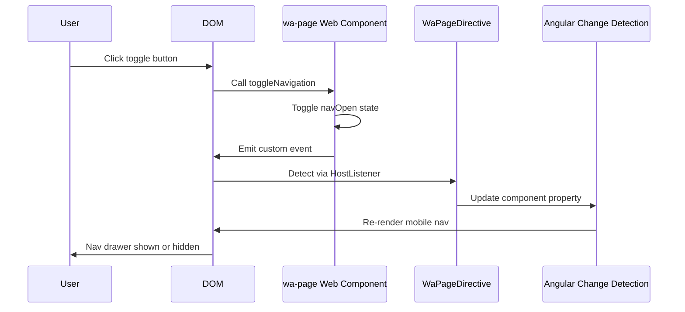

```mermaid
sequenceDiagram
    participant User as User
    participant DOM as DOM
    participant WebComponent as wa-page Web Component
    participant Directive as WaPageDirective
    participant Angular as Angular Change Detection
    
    User->>DOM: Click toggle button
    DOM->>WebComponent: Call toggleNavigation
    WebComponent->>WebComponent: Toggle navOpen state
    WebComponent->>DOM: Emit custom event
    DOM->>Directive: Detect via HostListener
    Directive->>Angular: Update component property
    Angular->>DOM: Re-render mobile nav
    DOM->>User: Nav drawer shown or hidden
```
