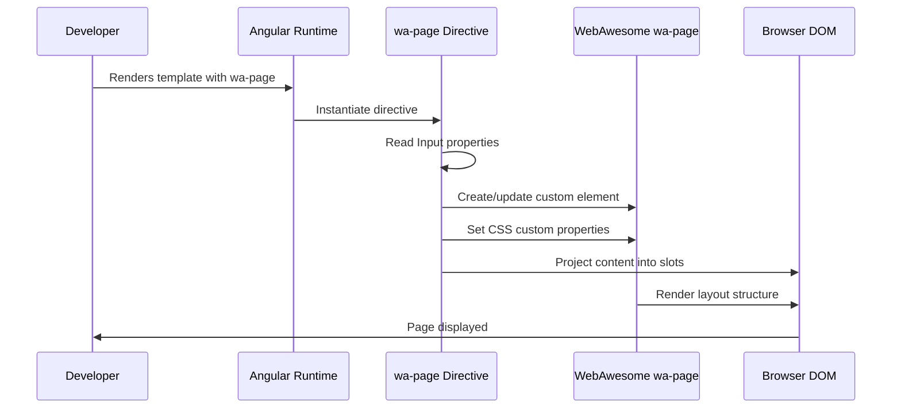

```mermaid
sequenceDiagram
    participant Dev as Developer
    participant Angular as Angular Runtime
    participant WaPageDir as wa-page Directive
    participant WebComponent as WebAwesome wa-page
    participant DOM as Browser DOM
    
    Dev->>Angular: Renders template with wa-page
    Angular->>WaPageDir: Instantiate directive
    WaPageDir->>WaPageDir: Read Input properties
    WaPageDir->>WebComponent: Create/update custom element
    WaPageDir->>WebComponent: Set CSS custom properties
    WaPageDir->>DOM: Project content into slots
    WebComponent->>DOM: Render layout structure
    DOM->>Dev: Page displayed
```
